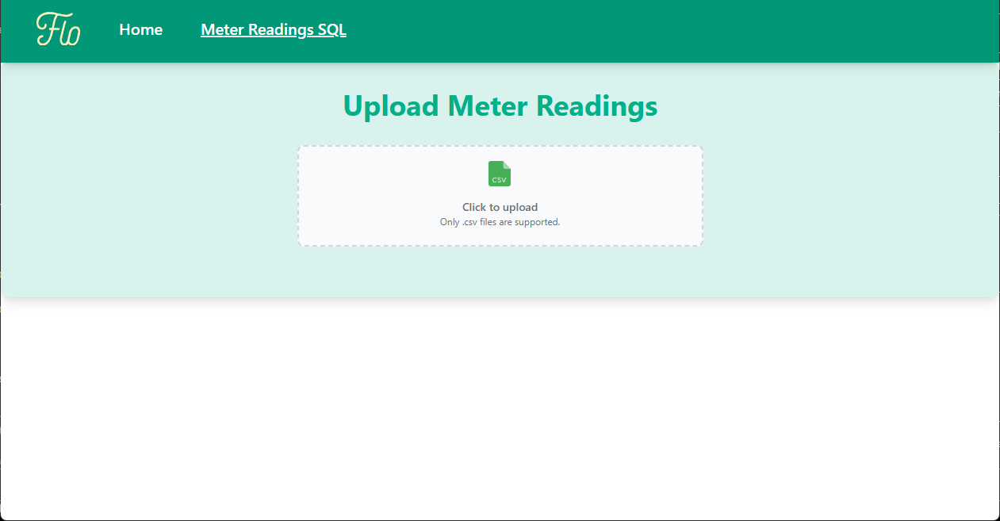

# NEM12 CSV to SQL Insert Generator

A browser-based tool that allows users to upload a NEM12-format CSV file and generate SQL INSERT statements for the meter_readings table.



### 👉 [Try the Demo](https://tztzt.github.io/flo-tools/)

> Note: Currently hosted on static github pages and subpage routes may not be handled correctly e.g. https://tztzt.github.io/flo-tools/meter

## Prerequisites

- Node.js (v20 or higher)
- npm or yarn package manager

## Getting Started

```
git clone https://github.com/tztzt/flo-meter-reader.git
cd flo-meter-reader
npm install
npm run dev

npm run test            # Run the test suite using Vitest
npm run coverage        # Generate test coverage report and metrics
```

---

## Problem Overview

### Objective

Build a tool that:

- Accepts NEM12 CSV files
- Parses valid metering data from the file
- Generates corresponding SQL INSERT statements
- Displays a preview of parsed data and resulting SQL

### Requirements

- Upload and parse large CSV files entirely on the client-side
- Handle data integrity and formatting
- Provide a clear UI for previewing and extracting results

### Technical objectives

- Provide a centralised suite of tools instead of building separate products for various purposes
- Create a skeletal scaffold for future development of other tools

## Design & Architecture

### Tech Stack

| Tool                            | Why It Was Chosen                                                                                                  | Possible Cons                                                                    |
| ------------------------------- | ------------------------------------------------------------------------------------------------------------------ | -------------------------------------------------------------------------------- |
| React 18 + Vite                 | Fast dev environment, clean client-side architecture. React 18 for best test-compatibility, out of the box webpack | Limited customisations and functional support                                    |
| Tailwind CSS                    | Utility-first styling for rapid iteration, less files to handle and context switching                              | Learning curve for developers used to CSS, does not support all CSS capabilities |
| PapaParse                       | Efficient, performant CSV parsing                                                                                  | Requires understanding of API for advanced parsing functions                     |
| Vitest + Jest + Testing Library | Ensures components and logic are tested                                                                            |

## File Format Assumptions

### NEM12 Structure

The file contains hierarchical records:

- 100 record – metadata header (one per file)
- 200 records – NMI identifiers and interval configuration
- 300 records – daily interval data (multiple per 200)
- 400 / 500 / 900 – footer and other records

### Parsing Logic

Omit records 400 / 500 / 900, not needed for this function's purpose.

For each 200 record:

- Extract NMI and interval length (assumed at index -2)
- For each associated 300 record:
  - Parse the interval date
  - Extract consumption values (according to interval length
    - e.g. length = 30 - 1440 / 30 = 48 interval values)
  - For each timestamp, generate an INSERT with:
    - NMI
    - Timestamp (computed from date + interval index)
    - Consumption (Sum of all the values in range, rounded to 4 d.p.)

## 📁 Project Structure

### Feature-Sliced Architecture

The project follows a feature-sliced modular architecture, which organizes code by feature rather than technical type. This improves scalability, readability, and collaboration by keeping related logic close together.

```
src/
├── components/             # Reusable global UI components
│   ├── Uploader/           # File upload UI and logic
│   └── NavBar/             # Top navigation bar
├── pages/                  # Feature-based page modules
│   ├── MeterReadingSQL/
│   │   ├── components/     # Page-specific components
│   │   └── index.tsx       # Main logic: upload, preview, and SQL generation
│   └── HomePage/           # Simple landing page
├── routes/                 # Route configuration
├── hooks/                  # Shared custom React hooks
├── types/                  # Global TypeScript type definitions
└── App.tsx                 # Main application entry and layout

```

### Test Design

Test files are colocated with the components they test. This approach promotes:

- Better context and readability

- Faster navigation and iteration

- Scalability as the codebase grows

Each feature or component has its test logic nearby, ensuring changes are easier to verify and maintain.

## Key Features

- ✅ Upload NEM12 CSV files (large file support)
- ✅ Efficient parsing with PapaParse streaming
- ✅ SQL generation for meter_readings table
- ✅ Preview and toggle between raw and parsed data
- ✅ Clean, minimal interface with Tailwind
- ✅ Moderate test coverage for core components and logic

### Secondary Features

- Process multiple files quickly by removing uploaded files to upload other files
- Support for data sets with other data intervals besides `30`
- Conveniently copy SQL Insert statements or export in an `.sql` file

## Example SQL Output

### Sample Input Data

Below is an example of a NEM12 format CSV file that demonstrates the expected input structure. The full sample file is available at `./src/assets/test_meter_reading.csv`:

```
100,NEM12,200506081149,UNITEDDP,NEMMCO
200,NEM1201009,E1E2,1,E1,N1,01009,kWh,30,20050610
300,20050301,0,0,0,0,0,0,0,0,0,0,0,0,0.461,0.810,0.568,1.234,1.353,1.507,1.344,1.773,0.487,
1.302,1.685,0.354,1.391,1.335,1.695,0.568,1.098,1.702,1.208,0.361,0.796,0.869,1.615,0.874,1
.056,0.723,0,0,0,0,0,0,0,0,0,0,A,0,20050310121004,20050310121004
300,20050302,0,0,0,0,0,0,0,0,0,0,0,0,0.235,0.567,0.890,1.123,1.345,1.567,1.543,1.234,0.420,
0.597,1.369,1.473,0.694,0.916,1.376,1.253,0.825,1.014,0.806,0.676,1.655,1.489,0.975,1.157,1
.076,0.536,0,0,0,0,0,0,0,0,0,0,A,0,20050310121004,20050310121004
300,20050303,0,0,0,0,0,0,0,0,0,0,0,0,0.261,0.310,0.678,0.934,1.211,1.134,1.423,1.370,0.729,
0.761,1.315,1.348,0.748,1.479,0.953,0.733,1.261,0.368,0.969,1.592,0.852,0.757,0.790,1.482,1
.377,0.577,0,0,0,0,0,0,0,0,0,0,A,0,20050310121004,20050310121004
300,20050304,0,0,0,0,0,0,0,0,0,0,0,0,0.335,0.667,0.790,1.023,1.145,1.777,1.563,1.344,1.000,
0.761,1.261,1.724,1.770,1.084,1.648,0.322,0.428,0.686,0.896,0.691,0.622,1.519,1.774,1.315,1
.712,1.321,0,0,0,0,0,0,0,0,0,0,A,0,20050310121004,20050310121004
500,O,S01009,20050310121004
```

Example - first 300 record:

```
NMI - NEM1201009
timestamp - 2005-03-01T00:00:00
consumption - 52.5410
```

```sql
INSERT INTO meter_readings ("nmi", "timestamp", "consumption")
VALUES ('NEM1201009', '2005-03-01T00:00:00', 52.5410);
```

## Assumptions Made

| Assumption                                                               | Reasoning                                                                                                                                                        |
| ------------------------------------------------------------------------ | ---------------------------------------------------------------------------------------------------------------------------------------------------------------- |
| Each file contains a single 100 header                                   | NEM12 standard format; observed pattern in sample data                                                                                                           |
| Fields like QualityMethod, ReasonCode, and ReasonDescription are ignored | Inconsistent presence across data; not required for SQL generation. High complexity involved in parsing each type of data due to optional fields in NEM12 format |
| Interval Length is extracted from the second-last index of 200 records   | Handles cases with missing optional fields                                                                                                                       |
| Duplicate NMI + timestamp pairs are allowed (aggregated if needed)       | To avoid conflicts with SQL unique constraints                                                                                                                   |

## Possible Improvements

| Area             | Suggestion                                                                                                                                   |
| ---------------- | -------------------------------------------------------------------------------------------------------------------------------------------- |
| Scalability      | Move parsing to Web Worker or Node.js service for very large files                                                                           |
| UI               | Add drag-and-drop support, SQL download, virtualisation for very large data                                                                  |
| Validation       | Add schema validation and user feedback for malformed files, 'fill in the blanks' with cell specific validation                              |
| Failure Handling | Add more robust error handling, feedback for failed SQL generation, regenerate SQL inputs for conflicting values                             |
| Testing          | Add full E2E test coverage with mocked file inputs                                                                                           |
| Standardisation  | Chakra UI, Next.js and CSS modules instead for consistent tech stack with the public Flo website, for better maintainability and scalability |

## Testing Strategy

- Component rendering (e.g., Title, Table preview)
- File upload interaction tests
- CSV parsing logic unit tests
- SQL generation unit tests

## Final Notes

This project is built as a client-side internal tooling platform to handle meter reading file uploads and transform them into structured SQL insert statements. It’s optimized for clarity, performance, and extensibility.
